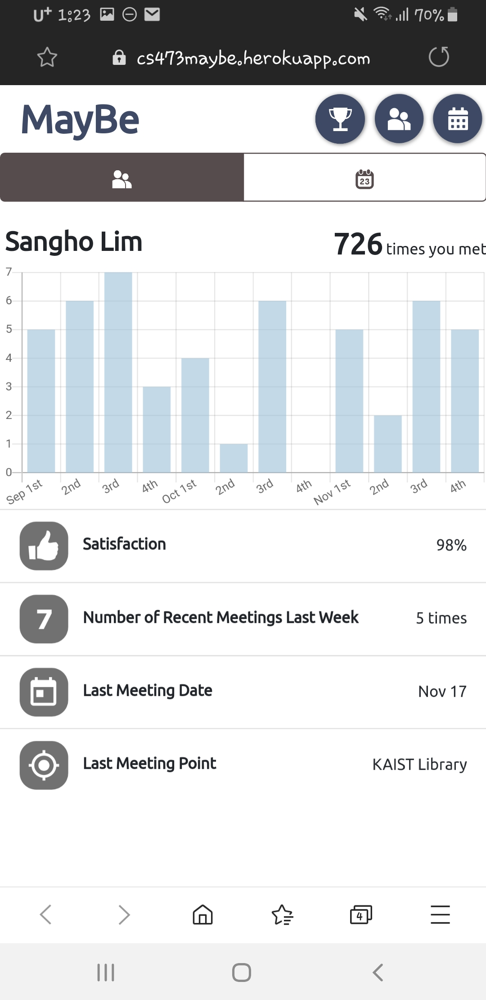
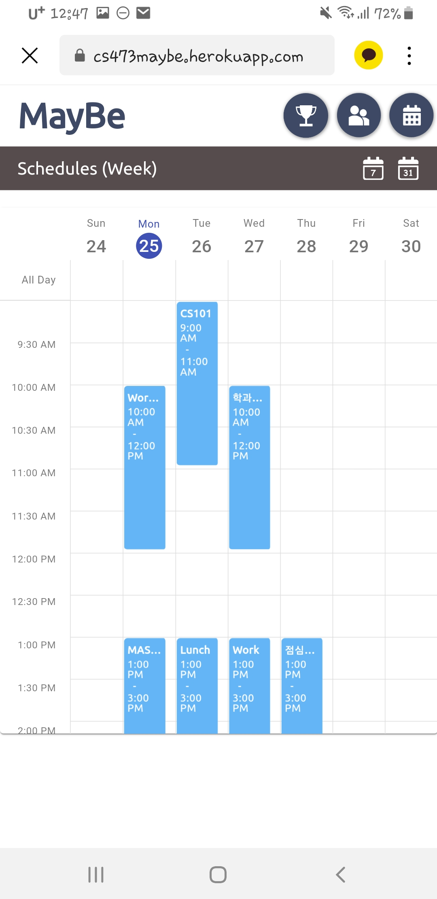
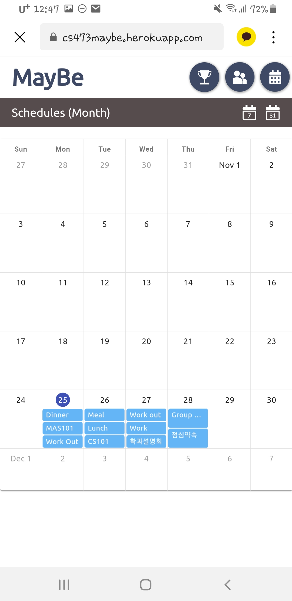

### [2019Fall CS473] <b>Design Project: High-Fi Prototype</b> 
by Changyeon Kim, Sangho Lim, Jiho Jin, Jisu Choi
# Instruction for <b>MayBe</b>

URL: https://cs473maybe.herokuapp.com/

>### <b>Log In</b>
>  
> This is the first screen that appears when you connect to MayBe. You can log in with the guest account. 
>>ID: guest 
>>PW: 0000 

>### <b>Make Appointment</b>
> 
> 
> 

>### <b>Be Punctual</b>
> 
>  
> (left) We assume that you arrive at the appointment on time. If you click the coin icon, you can earn some rewards. 
> (right) You can check the rank when you click the trophy icon.

>### <b>Recall Appointment</b>
> 
>  
> (left) You can see your overall monthly appointment statistics, when you click the avatar icon on the top right. 
> (right) You can check the statistics on meeting with each friend, when you click the graph icon in the friend list.

> ### <b>My Schedule</b>
> 
>  
> You can manage your schedule per week(left) or per month(right), when you click the calendar icon on the top right.
