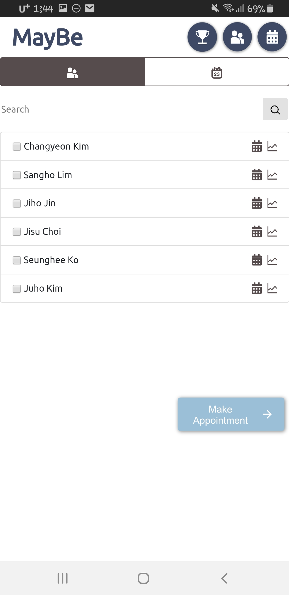

### [2019Fall CS473] <b>Design Project: High-Fi Prototype</b> 
by Changyeon Kim, Sangho Lim, Jiho Jin, Jisu Choi
# Instruction for <b>MayBe</b>

URL: https://cs473maybe.herokuapp.com/

>### <b>Log In</b>
>  
> This is the first screen that appears when you connect to MayBe. You can log in with the guest account. 
>>ID: guest 
>>PW: 0000 

>### <b>Make Appointment</b>
> 
> 
> 

>### <b>Be Punctual</b>
> 
> 
> 

>### <b>Recall Appointment</b>
> 

> ### <b>My Schedule</b>
> 
> 
